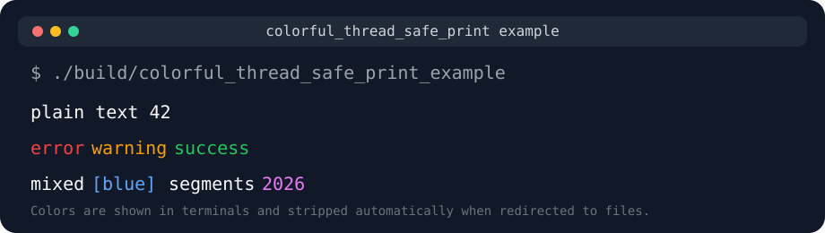
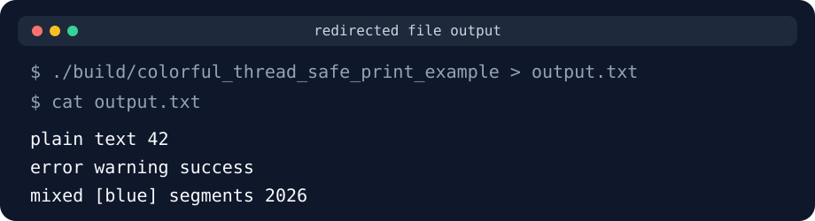

# colorful_thread_safe_print

[中文](#中文说明) | [English](#english)

## 中文说明

`colorful_thread_safe_print` 是一个轻量级 C++17 终端输出库。

它提供两件事：

- 类似 Python `print(...)` 风格的多参数打印
- 类似 Rust `colored` 风格的分段彩色输出

这个库会先把整行文本完整拼接出来，再一次性调用 `printf` 输出。这样在多线程场景下更不容易把一行内容拆碎。同时，它会自动检测当前输出是否连接到终端：

- 输出到终端时，保留 ANSI 颜色
- 重定向到文件或管道时，自动输出纯文本，不写入颜色转义码

### 接口概览

- `ctsp::p(...)`
  类似 `print`，接受任意数量参数，用空格拼接，末尾自动换行。
- `ctsp::c(value)`
  把任意可输出类型包装成可着色文本片段。
- `ctsp::c("hello").red()`
  给某一段文本单独设置颜色。

命名空间全名是 `colorful_thread_safe_print`，同时也提供更短的别名 `ctsp`。

### 支持的颜色

- `black()`
- `red()`
- `green()`
- `yellow()`
- `blue()`
- `magenta()`
- `cyan()`
- `white()`
- `bright_black()`
- `bright_red()`
- `bright_green()`
- `bright_yellow()`
- `bright_blue()`
- `bright_magenta()`
- `bright_cyan()`
- `bright_white()`
- `reset()`

### 基本用法

```cpp
#include "colorful_thread_safe_print.h"

int main() {
    ctsp::p("plain", "text", 42);

    ctsp::p(
        ctsp::c("error").red(),
        ctsp::c("warning").yellow(),
        ctsp::c("success").green());

    ctsp::p("year", ctsp::c(2026).bright_magenta());
    return 0;
}
```

### 输出行为

运行图示：



重定向到文件后的效果：



直接输出到终端时：

```bash
./build/colorful_thread_safe_print_example
```

你会在终端里看到彩色文本。

重定向到文件时：

```bash
./build/colorful_thread_safe_print_example > output.txt
```

`output.txt` 里只会保存纯文本，不会出现 `^[[31m` 之类的 ANSI 转义序列。

### 构建

这个项目使用 CMake。

```bash
./install_deps.sh
cmake -S . -B build -G Ninja
cmake --build build
```

或者直接使用：

```bash
./build.fish
```

清理构建产物：

```bash
./clean.fish
```

构建后可执行文件：

- 示例程序：`build/colorful_thread_safe_print_example`
- 测试程序：`build/mytest0`

### 运行示例

```bash
./build/colorful_thread_safe_print_example
```

### 运行测试

```bash
./test.fish
```

或者使用：

```bash
ctest --test-dir build --output-on-failure
```

或者直接运行：

```bash
./build/mytest0
```

## English

`colorful_thread_safe_print` is a lightweight C++17 terminal output library.

It focuses on two things:

- Python-like multi-argument printing
- Rust `colored`-style per-segment coloring

The library first builds the whole line into a single string, then writes it with one `printf` call. This makes line-oriented output safer in multithreaded usage. It also detects whether `stdout` is attached to a terminal:

- When writing to a terminal, ANSI colors are enabled
- When redirecting to a file or pipe, colors are stripped automatically

### API Overview

- `ctsp::p(...)`
  A print-style function that accepts any number of arguments, joins them with spaces, and appends a newline.
- `ctsp::c(value)`
  Wraps any streamable value as a colorable text segment.
- `ctsp::c("hello").red()`
  Applies color to one specific segment.

The full namespace is `colorful_thread_safe_print`, and the shorter alias `ctsp` is also provided.

### Available Colors

- `black()`
- `red()`
- `green()`
- `yellow()`
- `blue()`
- `magenta()`
- `cyan()`
- `white()`
- `bright_black()`
- `bright_red()`
- `bright_green()`
- `bright_yellow()`
- `bright_blue()`
- `bright_magenta()`
- `bright_cyan()`
- `bright_white()`
- `reset()`

### Basic Example

```cpp
#include "colorful_thread_safe_print.h"

int main() {
    ctsp::p("plain", "text", 42);

    ctsp::p(
        ctsp::c("error").red(),
        ctsp::c("warning").yellow(),
        ctsp::c("success").green());

    ctsp::p("year", ctsp::c(2026).bright_magenta());
    return 0;
}
```

### Output Behavior

Example output:


Redirected file output:


When writing directly to a terminal:

```bash
./build/colorful_thread_safe_print_example
```

you will see colored output in the terminal.

When redirecting to a file:

```bash
./build/colorful_thread_safe_print_example > output.txt
```

the file will contain plain text only, without ANSI escape sequences such as `^[[31m`.

### Build

This project uses CMake.

```bash
./install_deps.sh
cmake -S . -B build -G Ninja
cmake --build build
```

Or simply run:

```bash
./build.fish
```

To remove build artifacts:

```bash
./clean.fish
```

Generated executables:

- Example program: `build/colorful_thread_safe_print_example`
- Test program: `build/mytest0`

### Run the Example

```bash
./build/colorful_thread_safe_print_example
```

### Run Tests

```bash
./test.fish
```

or use:

```bash
ctest --test-dir build --output-on-failure
```

or run the test binary directly:

```bash
./build/mytest0
```
